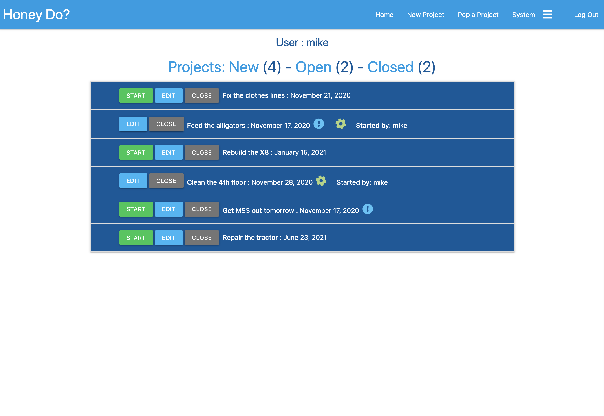

# Mike Magee - Code Institute Milestone 3  Honey-Do app 

The requirement of this project is to "... build a full-stack site that allows your users to manage a common dataset about a particular domain."

Even before the Task Manager mini project was presented, I have wanted to build an electronic "Job Jar" similar to the on in the "Hi and Louis" strip.  We currently have a yellow sticky version of this called the Honey Do wall.

My approach was to provide an intuitive app with a clean presentation. 

The fundamental use case for this first version is: 
    - A family has one "account" with basic name/password validation
    - Within this account there are users eg: Dad, Mom, child1 etc.. 
    - Anyone can create a project, assign goals, priority and "reward points" 
    - Anyone can open, complete and earn the award points. 
    - 

 
***
## UX 

### User goals 
* An app that is simple to approach and use. 
* Controls and interactions that are familiar and predictable.
* Responsive across device types.
* Somewhat fun. 

### User Stories 
* As a user I expect the app to be usable without instruction if possible
* As a user I expect adding a new project to be simple and fast
* As a user I expect accessing, opening and closing projects to be simple
* As a user I expect searching for projects via various criteria to be intuitive
* As a user I want to be able to observe how many projects are in what state. 
* As a user I want to be able to have the App "Pop" a project off based on criteria.

  
** MJM UPDATE FINAL IMAGE

*** 
Hosted app
The App is published at https://magee-ms3.herokuapp.com
***
Wireframes for usability on different devices

- [Initial idea](project/FirstDrawing.png)
- [Small Device](project/iPhone.png)
- [Medium Device](project/iPad.png)
- [Large Device](project/LargescreenDesktop.png)

## MINIMUM Features (Must Have) 
- **Simple Interface**: Must have a simple interface free of distraction and complexity 
- **Next Feature**: 

    
***

## STRETCH Features (Nice to have) 
- **tbd**: 

  
*** 

## DEFERRED Features (Wish I could, maybe I will) 
- **Email Notification**: Status email (Open, close etc) to creator

  *** 

## What I learned 
- **xxx**: 
  

***
## Technologies Used

In this section, you should mention all of the languages, frameworks, libraries, and any other tools that you have used to construct this project. For each, provide its name, a link to its official site and a short sentence of why it was used.

- JQuery to simplify DOM manipulation.
    - https://jquery.com)
- HTML Validation by freeformatter 
    - https://www.freeformatter.com/html-validator.html
- CSS Validation by W3C
    - https://jigsaw.w3.org/css-validator/
- Development framework Visual Studio Code (mac) by Microsoft v1.50.1
    -https://visualstudio.microsoft.com/vs/mac/
- Javascript 
    - https://www.javascript.com/
- Github - Source Code Control 
    - https://https://github.com/
    - Github integration to Heroku: https://devcenter.heroku.com/articles/github-integration
- Heroku - Platform as a service (PaaS) for cloud deployment of app 
    - https://www.heroku.com
- Mongo - NoSQL database 
    - MongoDB shell version v4.4.0
    - MongoDB server version: 4.2.10
- Materialize V1.0.0  - UI component library 
    - https://materializecss.com/
- Font Awesome - Fonts and Icons 
    - https://fontawesome.com/

******
## Testing 

** MJM Confirm current browser versions 
There should be no visible difference in behavior between browsers.  I have tested with:  
- Chrome Version 81.0.4044.122
- Firefox Version 75.0 (64-bit)
- Safari Version 13.0.5 (15608.5.11)

All tests described below have worked successfully across all browsers.
Responsiveness checks have been run by using the Chrome developers's tools as well as manually resizing the windows  

** MJM Outline testing results and observations here 

-- 

Key to matrix: 
* CB = Chrome Browser, CIPH = Chrome iPhone, CPAD = Chrome iPad			
* FFB = Firefox Browser, FFIPH = Firefox iPhone, FFPAD = Firefox iPad			
* SB = Safari Browser, SIPH = Safari iPhone, SPAD = Safari iPad	

** MJM Include completed testing matrix here 

## Deployment

This sample site is set up to use Heroku as a deployment target.  
** MJM CONFIRM
- App location is: https://magee-ms3.herokuapp.com

** MJM Describe environment variables required to run
    - MS3_ENVIRONMENT
    - MS3_MONGO_DBN
    - MS3_MONGO_URI
    - IP 
    - PORT 
    - SECRET_KEY 

This sample site can easily edited and run locally in the VSCode IDE by using the GoLive feature, which is how this code was developed.  To do this:
- From a terminal in the appropriate location clone a copy of the code locally: 
    - run: `git clone https://github.com/michaelmagee/magee-MS3.git`
    - then run `git remote rm origin` to remove the remote references to github.
- Then from VSCode, open a new window and open the newly cloned directory.   The Go Live button is on the bottom right.
### Gitpod Reminders

To run a frontend (HTML, CSS, Javascript only) application in Gitpod, in the terminal, type:

`git pull`   To be sure that the code is current
`python3 -m http.server`  

A blue button should appear to click: *Make Public*,

Another blue button should appear to click: *Open Browser*.

### Github to Heroku integration
    Described Here: https://devcenter.heroku.com/articles/github-integration
MJM DESCRIBE MANUAL AND AUTO GH->HEROKU Integration here 

## Credits
- Organizational and planning support from Mentor Brian M.  
- Attempted color inspiration from color.adobe.com
- Table of contents generated with markdown-toc: http://ecotrust-canada.github.io/markdown-toc/  
- Cool Excel to markdown utility by DaveJ: https://thisdavej.com/copy-table-in-excel-and-paste-as-a-markdown-table/
- Secret Key generation from: https://randomkeygen.com/  as suggested by CI

### Environment 
- Code Institute student template for Gitpod was used
- Locally, Visual Studio Code, periodically pushing to Githib/Gitpod

### Content
- All text and images are mine.

### Media
-  Fav Icon by https://icons8.com/icons/set/question-mark

### Acknowledgements

- I received inspiration for this project from examples from Code Institute that I played with as I was learning.  
- Memory Game and animation tutorials from Adam Khoury
- Javascript class usage tutorials NetNinjas
